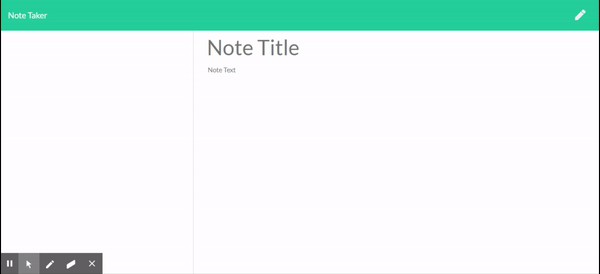
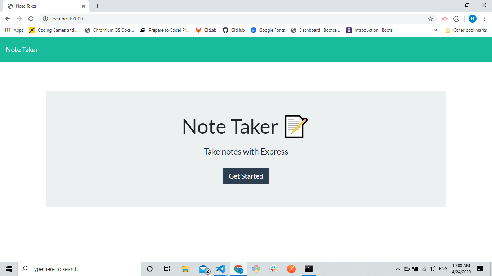
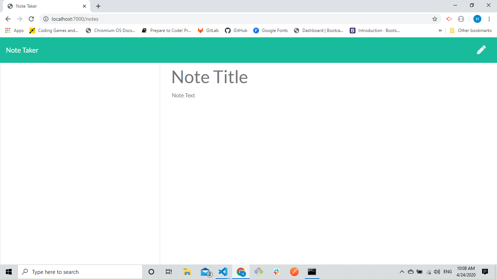

# Note Taker
 

## Table of Contents
<ul>
<li><strong>Description</strong></li>
<li><strong>Installation</strong></li>
<li><strong>Contributing</strong></li>
</ul>
 

## Description
 

 This is a simple Note Taker app that will help users with busy life schedules keep track of their daily activities. it is a very easy to use app. Below you will fing a video demonstrating how a user can add a note, view previously added notes and delete notes.

 

## Installation
 

This app counts with the super powers of a server on the back end. We are using Node.js, Javascript and a library called Express to simplify the server process. In order for the application to run properly the server needs to be initialized. The user can fork or clone this repo, go to their command line and initialize the server typing "node server.js". They will receive a message on their command line console saying the server is listening and the PORT number. Then from there they will be able to access the app on their browser on "http://localhost:7000/".

 

## Contributing
 

No contributors.

 

